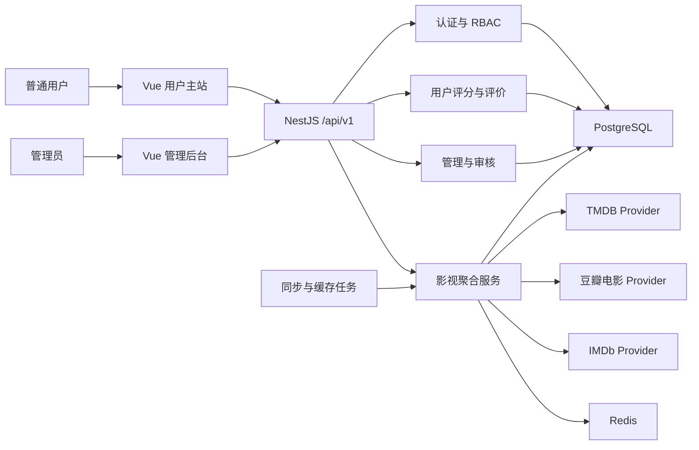

## 2026-07-10 09:18

# MovieScope 技术方案设计（数据源修正版）

> 本版本覆盖此前方案中的数据源选择。影视外部数据源只允许使用用户提供的 `movie_api_ui_mapping.md` 中指定的三类 API：TMDB、豆瓣电影 API、IMDb API。

## 1. 技术方案概述

MovieScope 最终由用户主站、管理员后台和统一后端服务组成：

- 用户主站：面向普通访客与注册用户，提供首页、搜索、探索、榜单、新闻、影视详情、人物详情、评论影评和个人主页。
- 管理后台：面向管理员，提供用户管理、站内评价审核、影视数据映射、三类 API 数据源状态、缓存刷新和操作审计。
- 统一后端：承接登录鉴权、站内用户业务、TMDB/豆瓣/IMDb 数据聚合、缓存、管理接口和同步任务。

实施顺序保持“先前端、后后端”：首先完成主站和后台的页面、交互、响应式以及 Mock API；随后实现数据库、鉴权和用户业务后端；再按 TMDB → 豆瓣 → IMDb 的顺序接入真实 API；最后完成全站联调和部署。

前端只依赖统一站内契约，不直接处理三家 API 的差异。后端为三类数据源分别建立 Provider 适配器，将外部字段转换为 MovieScope 模型，并保留来源、原始外部 ID 和同步时间。

## 2. 唯一允许的影视数据源

| API | 项目定位 | 负责内容 |
| --- | --- | --- |
| TMDB | 网站主体数据源 | 搜索、探索、趋势、电影/剧集/人物详情、海报、背景图、演员、预告片、推荐、相似作品、观看平台 |
| 豆瓣电影 API | 中文口碑数据源 | 豆瓣评分、短评、长评、评价详情、近期热门电影、近期热门电视剧、中文受众趋势 |
| IMDb API | 国际化与深度数据源 | IMDb 榜单、奖项、票房、剧情摘要、演职员补充、新闻、流媒体精选、用户/影评人评价摘要 |

约束：

1. 不接入上述三类来源以外的影视 API。
2. TMDB、豆瓣、IMDb 的具体 Base URL、接口版本、鉴权和额度，以项目实际获得的对应 API 文档与密钥为准。
3. `movie_api_ui_mapping.md` 没有给出的供应商路径不得在方案中臆造；统一通过 Provider 配置落地。
4. 三家 API 都由后端调用，密钥不得进入浏览器构建产物。
5. MovieScope 站内评分、短评和观影记录属于站内数据库数据，不替代也不混入三家外部评分。

## 3. 三 API 功能与页面分工

### 3.1 首页

| UI 模块 | 主数据源 | 辅助数据源 |
| --- | --- | --- |
| Hero 大图推荐 | TMDB Trending | 豆瓣评分、IMDb 排名 |
| 热门电影 | TMDB Popular Movie | 豆瓣近期热门电影 |
| 热门剧集 | TMDB Popular TV | 豆瓣近期热门电视剧 |
| 高分榜 | TMDB Top Rated | IMDb Chart Rankings |
| 新闻区 | IMDb News by Category | 无 |

### 3.2 探索页

| UI 模块 | 主数据源 | 辅助数据源 |
| --- | --- | --- |
| 类型筛选 | TMDB Genre | 无 |
| 年份筛选 | TMDB Discover | 无 |
| 地区筛选 | TMDB Region | IMDb Countries of Origin |
| 评分筛选 | TMDB Vote Average | 豆瓣评分、IMDb 评分 |
| 热门趋势 | TMDB Trending | 豆瓣近期热门 |
| 流媒体筛选 | TMDB Watch Providers | IMDb Streaming Picks |

### 3.3 搜索页

| UI 模块 | 主数据源 | 辅助数据源 |
| --- | --- | --- |
| 综合结果 | TMDB Search Multi | 无 |
| 海报 | TMDB Poster | IMDb Extended Details |
| 标题、年份、类型 | TMDB | IMDb Base Info |
| 中文标题和中文评分 | 豆瓣 Subject Details | 无 |
| 国际评分和排名 | IMDb | 无 |

搜索列表先展示 TMDB 主结果。豆瓣和 IMDb 补充信息由后端批量查询或缓存补全，不允许前端对每张卡片分别发起外部请求。

### 3.4 电影详情页

| UI 模块 | 主数据源 | 辅助数据源 |
| --- | --- | --- |
| 背景图 | TMDB Backdrop | 无 |
| 海报 | TMDB Poster | IMDb Image |
| 基础信息 | TMDB Movie Details | IMDb Details |
| 演员导演 | TMDB Credits | IMDb Top Cast and Crew |
| 剧情简介 | TMDB Overview | IMDb Plot Summary |
| 评分区 | TMDB Vote | 豆瓣评分、IMDb 评分、MovieScope 评分 |
| 中文短评 | 豆瓣 Comments | 无 |
| 中文长评 | 豆瓣 Movie Reviews | 豆瓣 Review Details |
| 国际评论摘要 | IMDb Critics Review Summary | IMDb User Reviews Summary |
| 奖项 | IMDb Awards Summary | 无 |
| 票房 | IMDb Box Office Summary | 无 |
| 推荐 | TMDB Recommendations | IMDb Recommendations |
| 相似作品 | TMDB Similar | 无 |
| 播放来源 | TMDB Watch Providers | IMDb Streaming Picks |

### 3.5 剧集详情页

| UI 模块 | 主数据源 | 辅助数据源 |
| --- | --- | --- |
| 背景图和海报 | TMDB | IMDb Image |
| 基础信息 | TMDB TV Details | IMDb Extended Details |
| 季数、集数、季/集详情 | TMDB | IMDb Episodes 补充 |
| 演职员 | TMDB Credits | IMDb Cast and Crew |
| 评分区 | TMDB Vote | 豆瓣评分、IMDb 评分、MovieScope 评分 |
| 中文口碑 | 豆瓣短评/影评 | 无 |
| 奖项和评论摘要 | IMDb | 无 |
| 推荐和相似剧集 | TMDB | IMDb Recommendations |
| 播放来源 | TMDB Watch Providers | IMDb Streaming Picks |

### 3.6 人物详情页

| UI 模块 | 主数据源 | 辅助数据源 |
| --- | --- | --- |
| 人物头像 | TMDB Profile Image | 无 |
| 人物简介 | TMDB Person Details | IMDb 补充信息 |
| 代表作 | TMDB Combined Credits | IMDb Related Titles |
| 参演电影 | TMDB Movie Credits | 豆瓣评分补充 |
| 参演剧集 | TMDB TV Credits | 豆瓣评分补充 |

### 3.7 榜单页

| UI 模块 | 主数据源 | 辅助数据源 |
| --- | --- | --- |
| 趋势榜 | TMDB Trending | 无 |
| 热门电影榜 | TMDB Popular Movie | 豆瓣近期热门电影 |
| 热门剧集榜 | TMDB Popular TV | 豆瓣近期热门电视剧 |
| 高分榜 | TMDB Top Rated | 豆瓣评分、IMDb 排名 |
| IMDb 榜单/Top 250 | IMDb Chart Rankings | 无 |

### 3.8 评论与影评页

| UI 模块 | 主数据源 | 辅助数据源 |
| --- | --- | --- |
| 中文短评 | 豆瓣 Comments | 无 |
| 中文长评 | 豆瓣 Movie Reviews | 豆瓣 Review Details |
| 中文评价详情 | 豆瓣 Review Details | 无 |
| 国际用户评价摘要 | IMDb User Reviews Summary | 无 |
| 国际影评人摘要 | IMDb Critics Review Summary | 无 |
| 基础评论补充 | TMDB Reviews | 无 |
| MovieScope 用户评价 | 站内数据库 | 无 |

外部评论为只读内容；MovieScope 用户只能新增、修改或删除自己的站内评价。

### 3.9 新闻与推荐

- 新闻页完全由 IMDb News by Category 提供影视新闻、分类新闻和媒体资讯。
- 相关推荐以 TMDB Recommendations 为主，IMDb Recommendations 辅助。
- 相似内容使用 TMDB Similar。
- 推荐卡片可附加豆瓣评分与 IMDb 排名。

## 4. 真实 API 调用接口定义

### 4.1 TMDB Provider

TMDB 的实际请求以 TMDB API 文档为准，方案采用以下能力接口：

| 能力 | TMDB 接口 |
| --- | --- |
| 综合搜索 | `Search Multi` |
| 电影、剧集、人物搜索 | `Search Movie`、`Search TV`、`Search Person` |
| 趋势 | `Trending` |
| 探索 | `Discover Movie`、`Discover TV` |
| 热门/高分/上映 | `Popular`、`Top Rated`、`Now Playing`、`Upcoming` |
| 电影详情 | `Movie Details` |
| 剧集与季集详情 | `TV Details`、`Season Details`、`Episode Details` |
| 人物详情和作品 | `Person Details`、`Combined Credits` |
| 演职员 | `Credits` / `Aggregate Credits` |
| 媒体 | `Images`、`Videos` |
| 推荐与相似 | `Recommendations`、`Similar` |
| 外部 ID | `External IDs` |
| 观看平台 | `Watch Providers` |
| 类型与配置 | `Genre List`、`Configuration` |
| 基础评论 | `Reviews` |

### 4.2 豆瓣电影 Provider

具体路径由项目获得的豆瓣电影 API 文档配置，Provider 必须实现以下能力：

| Provider 方法 | 对应映射文档能力 |
| --- | --- |
| `getSubjectDetails` | 豆瓣电影/剧集条目详情、中文标题 |
| `getSubjectRating` | 豆瓣评分与评价人数 |
| `getComments` | 中文短评、摘要、互动计数 |
| `getReviews` | 中文长评列表 |
| `getReviewDetails` | 长评/评价详情 |
| `getRecentPopularMovies` | 近期热门电影 |
| `getRecentPopularTv` | 近期热门电视剧 |
| `getChineseTrends` | 中文观众热门趋势 |

### 4.3 IMDb Provider

具体路径由项目获得的 IMDb API 文档配置，Provider 必须实现以下能力：

| Provider 方法 | 对应映射文档能力 |
| --- | --- |
| `getBaseTitle` / `getExtendedTitle` | 基本信息、扩展详情、英文标题、年份、类型 |
| `getPlotSummary` | 剧情摘要 |
| `getTopCastAndCrew` | 主要演员和工作人员 |
| `getBoxOfficeSummary` | 票房摘要 |
| `getAwardsSummary` | 奖项摘要 |
| `getUserReviewsSummary` | 用户评价摘要 |
| `getCriticsReviewSummary` | 影评人评论摘要 |
| `getChartRankings` | 榜单排名、Top 250、排名监控 |
| `getNewsByCategory` | 分类新闻、影视新闻、相关新闻 |
| `getStreamingPicks` | 流媒体精选 |
| `getRecommendations` | IMDb 推荐 |
| `getEpisodes` | 剧集分集数据补充 |
| `getCountriesOfOrigin` | 原产国数据 |
| `getReleaseExpectation` | 发行预期 |

### 4.4 API 配置注册表

由于豆瓣与 IMDb 的具体路径未在映射文档中给出，后端使用配置注册表，避免把供应商细节写死在业务层：

```ts
interface ProviderEndpointConfig {
  baseUrl: string
  authType: 'bearer' | 'query' | 'header'
  apiKeyEnv: string
  endpoints: Record<string, string>
  timeoutMs: number
  enabled: boolean
}
```

配置缺失时后台显示“未配置”，对应辅助模块进入部分数据状态；不得自动切换到其他影视 API。

## 5. 技术选型

| 类别 | 选择 | 理由 |
| --- | --- | --- |
| 仓库 | pnpm workspace monorepo | 主站、后台、后端共享契约与工具配置 |
| 用户主站 | Vue 3 + Vite + TypeScript | 满足指定技术栈，适合高交互内容站 |
| 管理后台 | Vue 3 + Vite + TypeScript | 与主站基础一致，独立构建与授权 |
| Vue 写法 | Composition API + `<script setup lang="ts">` | 类型清晰，组件和 composable 边界明确 |
| 路由 | Vue Router 4 | 双端路由和权限守卫 |
| 全局状态 | Pinia | 会话、权限、偏好和全局字典 |
| 服务端状态 | TanStack Query for Vue | 请求缓存、分页、失效和重试 |
| UI | Tailwind CSS + Headless 组件 + Lucide | 便于后续按设计稿调整，兼顾可访问性 |
| 表单 | VeeValidate + Zod | 表单与接口 Schema 统一校验 |
| 前端 Mock | MSW | 前端先行并覆盖三 API 聚合结果与异常 |
| 后端 | NestJS + TypeScript | 模块化、鉴权、任务、缓存与 OpenAPI 完整 |
| ORM/数据库 | Prisma + PostgreSQL | 用户、评价、权限、审核与映射适合关系模型 |
| 缓存 | Redis | 三家外部 API 缓存、限流和任务锁 |
| 测试 | Vitest + Vue Test Utils + Playwright | 覆盖组件、接口与双端关键流程 |
| 部署 | Docker Compose 起步 | 统一开发、测试和部署环境 |

## 6. 总体架构



### 6.1 Monorepo 目录

```text
MovieScope/
  apps/
    web/                  # 用户主站
    admin/                # 管理后台
    api/                  # NestJS 后端
  packages/
    contracts/            # DTO、Zod Schema、分页与错误码
    ui/                   # 共享基础组件、设计 Token
    api-client/           # 统一站内 API 客户端
    config/               # TypeScript、ESLint、环境配置
  docs/
  docker/
  pnpm-workspace.yaml
```

## 7. 用户主站设计

### 7.1 路由

| 路由 | 页面 | 权限 |
| --- | --- | --- |
| `/` | 首页 | 公开 |
| `/search` | 综合搜索 | 公开 |
| `/discover` | 探索 | 公开 |
| `/charts` | 榜单 | 公开 |
| `/news` | IMDb 新闻 | 公开 |
| `/movie/:id` | 电影详情 | 公开，个人操作需登录 |
| `/tv/:id` | 剧集详情 | 公开，个人操作需登录 |
| `/person/:id` | 人物详情 | 公开 |
| `/reviews/:mediaType/:id` | 评论与影评 | 公开 |
| `/login`、`/register` | 登录注册 | 游客 |
| `/me` | 个人主页 | 登录 |
| `/me/library` | 想看/在看/看过/收藏 | 登录 |
| `/me/ratings` | 评分和站内短评 | 登录 |
| `/me/history` | 浏览和搜索历史 | 登录 |
| `/settings/profile` | 资料设置 | 登录 |

### 7.2 主站组件

- `AppShell`：导航、搜索、用户菜单和全局状态。
- `MediaCard`：展示 TMDB 主体信息，可附加豆瓣/IMDb/MovieScope 评分。
- `MediaRail`：主页内容分区。
- `SearchCommand`：TMDB 综合搜索建议和最近搜索。
- `DiscoverFilters`：TMDB 筛选条件与 URL 同步。
- `MediaHero`：TMDB 主视觉与核心信息。
- `ExternalRatings`：TMDB、豆瓣、IMDb 和 MovieScope 评分分区展示。
- `CreditsSection`：TMDB 主数据、IMDb 补充。
- `DoubanReviewsSection`：豆瓣中文短评和长评。
- `ImdbInsightSection`：IMDb 奖项、票房、评论摘要和排名。
- `RecommendationSection`：TMDB 推荐/相似，IMDb 推荐补充。
- `UserMediaActions`：站内状态、收藏、评分和评价。

路由 View 只编排 Query 与模块。外部数据不可在组件内直接请求，统一通过站内 `api-client`。

## 8. 管理后台设计

### 8.1 页面

| 路由 | 页面 | 主要能力 |
| --- | --- | --- |
| `/admin` | 概览 | 用户、评价、影视缓存、三 API 状态 |
| `/admin/users` | 用户管理 | 查询、禁用、解禁、角色调整 |
| `/admin/reviews` | 站内评价审核 | 通过、隐藏、删除、恢复 |
| `/admin/media` | 影视实体映射 | TMDB、豆瓣、IMDb ID 映射校正 |
| `/admin/providers` | 数据源管理 | 三 API 配置状态、延迟、错误率和探测 |
| `/admin/cache` | 缓存管理 | 按数据源/影视实体失效和刷新 |
| `/admin/sync-jobs` | 同步任务 | 热门、详情、榜单、新闻同步状态 |
| `/admin/audit-logs` | 审计日志 | 管理员操作追踪 |
| `/admin/settings` | 系统设置 | 白名单业务配置 |

### 8.2 管理规则

- 管理员不公开注册；首个 `SUPER_ADMIN` 通过 seed 或 CLI 创建。
- 角色包含 `USER`、`MODERATOR`、`ADMIN`、`SUPER_ADMIN`。
- 管理端主要审核 MovieScope 站内用户内容；豆瓣和 IMDb 外部评论只读，不在本系统修改。
- 外部 API 密钥只由环境变量或 Secret Manager 管理，后台仅显示配置状态和脱敏标识。
- 用户处置、评价处置、映射修改、缓存刷新和角色变更必须写入审计日志。

## 9. 前端先行契约

第一阶段在 `packages/contracts` 定义并冻结统一模型：

```ts
interface RatingSnapshot {
  source: 'tmdb' | 'douban' | 'imdb' | 'moviescope'
  value: number
  scale: 5 | 10 | 100
  count?: number
  rank?: number
  updatedAt?: string
}

interface MediaSummary {
  id: string
  mediaType: 'movie' | 'tv'
  title: string
  originalTitle?: string
  year?: number
  posterUrl?: string
  backdropUrl?: string
  genres: GenreRef[]
  overview?: string
  ratings: RatingSnapshot[]
  userState?: UserMediaState
  sources: SourceRef[]
}

interface MediaDetail extends MediaSummary {
  runtimeMinutes?: number
  status?: string
  releaseDate?: string
  credits: CreditGroup
  videos: MediaVideo[]
  images: MediaImage[]
  recommendations: MediaSummary[]
  similar: MediaSummary[]
  douban?: DoubanSubjectBundle
  imdb?: ImdbInsightBundle
  sourceMeta: SourceSnapshot[]
}
```

MSW 必须覆盖正常、空、慢响应、未登录、无权限、限流、服务失败、TMDB 主源失败、豆瓣辅助失败、IMDb 辅助失败、缺图和超长内容。

## 10. 后端模块

| 模块 | 职责 |
| --- | --- |
| Auth | 注册、登录、刷新、退出、令牌轮换 |
| Users | 个人资料、账号状态、角色和隐私 |
| Catalog | 首页、搜索、探索、详情、人物、榜单、新闻聚合 |
| TmdbProvider | TMDB 搜索、探索、详情、图片、人物、推荐 |
| DoubanProvider | 豆瓣条目、评分、短评、长评和近期热门 |
| ImdbProvider | IMDb 详情、榜单、奖项、票房、新闻和评论摘要 |
| MediaMapping | TMDB、豆瓣、IMDb 外部 ID 映射 |
| Library | 观影状态和收藏 |
| Ratings | MovieScope 评分与聚合 |
| Reviews | MovieScope 站内短评 CRUD 与审核 |
| History | 浏览和搜索历史 |
| Admin | 用户、审核、映射、数据源与缓存管理 |
| Jobs | 热门、详情、榜单、新闻和缓存同步 |
| Health | 服务、数据库、Redis 和三 Provider 健康检查 |

### 10.1 Provider 接口

```ts
type ProviderName = 'tmdb' | 'douban' | 'imdb'

interface ProviderHealth {
  provider: ProviderName
  enabled: boolean
  configured: boolean
  status: 'healthy' | 'degraded' | 'down'
  latencyMs?: number
  checkedAt: string
}

interface ExternalProvider {
  readonly name: ProviderName
  healthCheck(): Promise<ProviderHealth>
}
```

TMDB 是主体 Provider；豆瓣和 IMDb 是补充 Provider，但在榜单、评论、新闻等页面可按照映射文档成为该模块的主数据源。

## 11. 数据聚合与映射

### 11.1 映射键

`media_entities` 为站内影视实体，`external_ids` 保存：

- TMDB movie/tv ID
- 豆瓣 subject ID
- IMDb title ID

匹配优先级：

1. 外部 API 返回的交叉 ID。
2. 后台人工确认的映射。
3. 标题、原名、年份、媒体类型和主创的候选匹配。
4. 无法确认时不自动合并，进入后台待处理队列。

### 11.2 详情聚合流程

1. 前端请求站内电影或剧集 ID。
2. 后端读取映射和缓存。
3. TMDB 返回主视觉、基础信息、演职员、视频、推荐和相似内容。
4. 豆瓣 Provider 返回条目、评分、短评和长评。
5. IMDb Provider 返回扩展详情、剧情摘要、奖项、票房、排名和评论摘要。
6. 加载 MovieScope 站内评分、评价、状态和收藏。
7. 按页面模型合并，附带三来源状态和更新时间。
8. 豆瓣或 IMDb 失败时返回 TMDB 主体和站内数据；TMDB 失败但缓存可用时返回过期缓存并标记刷新中。

### 11.3 字段规则

- 主视觉、基本标题、类型、图片、演员、视频：TMDB 优先。
- 中文口碑、豆瓣评分、中文短评和长评：豆瓣 Provider。
- IMDb 排名、奖项、票房、新闻、国际评论摘要：IMDb Provider。
- MovieScope 用户评分和短评：站内数据库。
- 不对 TMDB、豆瓣、IMDb、MovieScope 的评分做算术平均；每个来源独立展示。

## 12. 站内 API 设计

基础路径：`/api/v1`。

### 12.1 主站公开接口

| 方法 | 路径 | 说明 |
| --- | --- | --- |
| GET | `/home` | TMDB 主体 + 豆瓣热门 + IMDb 榜单/新闻 |
| GET | `/search` | TMDB 搜索并补充豆瓣/IMDb 数据 |
| GET | `/search/suggestions` | 搜索建议 |
| GET | `/discover` | TMDB 筛选，豆瓣/IMDb 评分补充 |
| GET | `/charts` | TMDB 热门高分、豆瓣热门、IMDb 榜单 |
| GET | `/news` | IMDb 新闻分类和分页 |
| GET | `/media/:mediaType/:id` | 三 API 聚合详情 |
| GET | `/media/:mediaType/:id/external-reviews` | 豆瓣影评 + IMDb 评论摘要 + TMDB Reviews |
| GET | `/media/:mediaType/:id/reviews` | MovieScope 站内短评 |
| GET | `/people/:id` | TMDB 人物 + IMDb 补充 + 作品豆瓣评分 |
| GET | `/genres` | TMDB 类型字典 |

### 12.2 用户接口

| 方法 | 路径 | 说明 |
| --- | --- | --- |
| POST | `/auth/register` | 注册 |
| POST | `/auth/login` | 登录 |
| POST | `/auth/refresh` | 令牌轮换 |
| POST | `/auth/logout` | 退出并撤销会话 |
| GET/PATCH | `/me` | 获取/修改资料 |
| GET | `/me/library` | 状态和收藏列表 |
| PUT/DELETE | `/me/media/:mediaId/status` | 设置/取消观影状态 |
| PUT/DELETE | `/me/media/:mediaId/favorite` | 收藏/取消收藏 |
| PUT/DELETE | `/me/media/:mediaId/rating` | 保存/删除评分 |
| PUT/DELETE | `/me/media/:mediaId/review` | 保存/删除站内短评 |
| GET/DELETE | `/me/history/views` | 查询/清空浏览历史 |
| GET/DELETE | `/me/history/searches` | 查询/清空搜索历史 |

### 12.3 管理接口

| 方法 | 路径 | 说明 |
| --- | --- | --- |
| GET | `/admin/dashboard` | 业务与三 API 概览 |
| GET/PATCH | `/admin/users/:id` | 用户查询和处置 |
| GET | `/admin/reviews` | 站内评价审核队列 |
| POST | `/admin/reviews/:id/actions` | 通过、隐藏、删除、恢复 |
| GET/PATCH | `/admin/media/:id/mappings` | TMDB/豆瓣/IMDb ID 映射 |
| GET | `/admin/providers` | 三 API 健康、延迟和错误率 |
| POST | `/admin/providers/:name/probe` | 探测指定 API |
| POST | `/admin/cache/invalidate` | 按来源或实体失效缓存 |
| POST | `/admin/media/:id/refresh` | 重新聚合三 API 数据 |
| GET | `/admin/sync-jobs` | 同步任务记录 |
| GET | `/admin/audit-logs` | 审计日志 |

### 12.4 错误响应

统一区分 `VALIDATION_ERROR`、`AUTH_REQUIRED`、`FORBIDDEN`、`RESOURCE_NOT_FOUND`、`RATE_LIMITED`、`TMDB_UNAVAILABLE`、`DOUBAN_UNAVAILABLE`、`IMDB_UNAVAILABLE` 和 `SERVICE_UNAVAILABLE`。

公开聚合接口返回 `sourceMeta`，让前端显示“豆瓣内容暂不可用”或“IMDb 深度信息暂不可用”，而不是让辅助源失败破坏整个页面。

## 13. 数据模型

### 13.1 用户和权限

- `users`：账号、密码哈希、昵称、头像、简介、状态。
- `roles`、`user_roles`：`USER|MODERATOR|ADMIN|SUPER_ADMIN`。
- `sessions`：刷新令牌哈希、到期与撤销信息。

### 13.2 影视与外部数据

**media_entities**

- `id`, `media_type`, `canonical_title`, `original_title`, `release_year`
- `tmdb_id`, `status`, `poster_path`, `last_synced_at`
- 唯一索引：`media_type + tmdb_id`

**external_ids**

- `media_id`, `provider`: `TMDB|DOUBAN|IMDB`, `external_id`
- 唯一索引：`provider + external_id`
- 唯一索引：`media_id + provider`

**media_snapshots**

- `media_id`, `provider`, `payload_json`, `fetched_at`, `expires_at`
- `status`, `error_code`

**mapping_candidates**

- `media_id`, `provider`, `candidate_external_id`, `confidence`
- `status`: `PENDING|CONFIRMED|REJECTED`
- `reviewed_by`, `reviewed_at`

### 13.3 用户影视数据

- `user_media_states`：用户、影视、`WANT|WATCHING|WATCHED`。
- `favorites`：用户与影视唯一收藏。
- `ratings`：MovieScope 1-10 整数评分，用户+影视唯一。
- `reviews`：MovieScope 站内短评、公开与审核状态。
- `rating_aggregates`：站内平均分、人数和 1-10 分布。
- `view_history`：同一影视合并并更新最近访问时间。
- `search_history`：关键词、筛选摘要与时间。

### 13.4 管理与运行数据

- `moderation_actions`：站内评价处置记录。
- `audit_logs`：管理员操作前后值和请求信息。
- `provider_sync_logs`：TMDB、豆瓣、IMDb 调用状态、耗时和错误码。
- `sync_jobs`：榜单、新闻、热门和详情同步任务。
- `system_settings`：后台允许调整的白名单配置，不存 API 密钥。

## 14. 缓存与容错

| 数据 | 建议 TTL |
| --- | --- |
| TMDB Configuration/Genre | 7 天 |
| TMDB 趋势、热门和探索 | 15-30 分钟 |
| 豆瓣近期热门 | 30-60 分钟 |
| IMDb 榜单和新闻 | 30-60 分钟 |
| 电影/剧集/人物详情 | 24 小时 |
| 豆瓣评分和评论摘要 | 6-24 小时 |
| IMDb 奖项、票房、评论摘要 | 24 小时至 7 天 |
| MovieScope 评分聚合 | 写时更新，短缓存 1-5 分钟 |

- 三个 Provider 分别设置超时、重试、限流和熔断，互不拖垮。
- 搜索与列表不逐卡实时调用豆瓣/IMDb，采用批量接口、后台同步或已有缓存。
- TMDB 主数据失败时优先返回缓存；豆瓣或 IMDb 失败时页面降级为主体信息。
- 所有缓存键按 Provider、接口版本、语言、地区和请求参数隔离。
- 用户状态在返回前单独合并，不写入公共影视缓存。

## 15. 安全设计

- 三类 API 密钥只在后端环境变量或 Secret Manager 中保存。
- 密码使用 Argon2id；Access Token 短期有效，Refresh Token 使用 HttpOnly Cookie 并轮换。
- 注册、登录、搜索、评价和后台探测接口限流。
- DTO 白名单校验；外部 API 文本也视为不可信内容，规范化后输出。
- 后台 RBAC 同时校验账号状态和角色。
- 豆瓣、IMDb 的外部评论只读；管理员不能通过本站修改外部来源内容。
- 管理操作写入不可由普通管理员删除的审计日志。

## 16. 测试策略

### 前端阶段

- 使用 MSW 模拟 TMDB 主体、豆瓣中文口碑、IMDb 深度信息的聚合响应。
- 单独模拟三个 Provider 成功、超时、限流和不可用状态。
- 组件测试覆盖媒体卡、多评分展示、豆瓣影评、IMDb 深度信息、站内评分和后台表格。
- Playwright 覆盖游客浏览、搜索详情、登录评价、个人主页和管理员审核。

### 后端阶段

- 单元测试覆盖三源字段合并、外部 ID 映射、评分隔离、权限和历史去重。
- Provider 合约测试使用对应 API 的脱敏 fixture，CI 不依赖实时外部网络。
- 受控环境执行 TMDB、豆瓣、IMDb 真实接口 smoke test。
- 全站联调后关闭 MSW，复跑同一套主站和后台 E2E。

## 17. 分阶段实施计划

保持四个大阶段，不按单个页面或接口细碎拆分。

### 阶段一：前端主站、后台与契约定型

目标：不依赖后端，完成两个可完整演示的 Vue 应用。

交付：

- 建立 monorepo、用户主站、管理后台、共享契约、UI 和请求包。
- 主站完成首页、搜索、探索、榜单、新闻、电影/剧集/人物详情、评论页、登录注册和个人主页。
- 后台完成概览、用户、评价审核、三源映射、Provider 状态、缓存、任务和审计页面。
- MSW 模拟 TMDB、豆瓣、IMDb 聚合数据、用户接口、管理接口和全部异常状态。
- 冻结 `/api/v1` 第一版契约。

验收：主站和后台在桌面与移动端可演示；三来源模块明确；Mock 不散落在组件内。

### 阶段二：后端基础与站内用户闭环

目标：完成数据库、鉴权和 MovieScope 自有业务，用真实后端替换用户与管理 Mock。

交付：

- NestJS、PostgreSQL、Prisma、Redis、迁移和环境配置。
- 注册登录、令牌轮换、RBAC、个人资料。
- 观影状态、收藏、评分、站内短评、浏览历史和搜索历史。
- 站内评分聚合、评价审核、用户管理和审计日志。
- 外部 ID 映射表、Provider 配置注册表和同步任务框架。

验收：用户数据重启后保持；管理员权限与审计有效；对应 Mock 可关闭。

### 阶段三：三类真实 API 接入与页面完善

目标：严格按映射文档将三类 API 接入真实页面。

交付：

- 先接 TMDB：主页主体、搜索、探索、影视详情、人物、图片、视频、推荐和相似内容。
- 再接豆瓣电影 API：中文评分、短评、长评、条目详情和近期热门。
- 最后接 IMDb API：榜单、奖项、票房、剧情摘要、演职员补充、新闻、流媒体和评论摘要。
- 完成三源 ID 映射、缓存、限流、超时、部分失败和同步日志。
- 根据真实字段、长文本、图片和缺失数据调整前端设计实现。

验收：最终外部影视数据只来自 TMDB、豆瓣、IMDb；三个 Provider 均有真实调用证据和后台状态；任一辅助源失败时主体页面仍可用。

### 阶段四：联调、质量收口与部署

目标：完成可部署和可验收版本。

交付：

- 完成主站、后台、数据库和三 API 全链路联调。
- 补齐单元、组件、集成和 Playwright 测试。
- 完成性能、无障碍、安全、响应式和错误状态检查。
- 完成 Docker、初始化管理员、数据库备份恢复、密钥配置和运维文档。
- 对照需求与方案执行最终验收。

验收：主站与后台均可部署；真实数据源无错误替代；密钥不泄漏；关键流程测试通过。

## 18. 关键决策

| 决策点 | 最终选择 |
| --- | --- |
| 外部影视 API | 仅 TMDB、豆瓣电影 API、IMDb API |
| 主体目录 | TMDB |
| 中文口碑 | 豆瓣电影 API |
| 国际深度信息 | IMDb API |
| 开发顺序 | 前端双端 → 后端用户业务 → 三 API 接入 → 联调部署 |
| 前端结构 | 用户主站与管理后台两个独立 Vue 3 + Vite 应用 |
| 后端结构 | NestJS 模块化单体 |
| 数据库存储 | PostgreSQL，Redis 缓存 |
| API 调用 | 全部通过后端 Provider，不允许浏览器直连密钥接口 |
| 外部评分 | 分来源独立展示，不混算 |
| 管理内容 | 站内用户与评价、三源映射和运行状态 |

## 19. 环境变量

```text
DATABASE_URL=
REDIS_URL=
JWT_ACCESS_SECRET=
JWT_REFRESH_SECRET=

TMDB_BASE_URL=
TMDB_API_TOKEN=

DOUBAN_API_BASE_URL=
DOUBAN_API_KEY=
DOUBAN_API_AUTH_TYPE=

IMDB_API_BASE_URL=
IMDB_API_KEY=
IMDB_API_AUTH_TYPE=

WEB_ORIGIN=
ADMIN_ORIGIN=
VITE_API_BASE_URL=/api/v1
VITE_ENABLE_MSW=false
```

豆瓣和 IMDb 的 Base URL、Key 与鉴权类型必须来源于后续提供的实际 API 文档，不在代码中写死假设。

## 20. 交接结论

本修正版已将数据来源完全收束为 TMDB、豆瓣电影 API 和 IMDb API，并严格采用 `movie_api_ui_mapping.md` 的页面职责：TMDB 负责主体展示，豆瓣负责中文口碑，IMDb 负责国际化和深度信息。

代码实现从阶段一开始：先完成用户主站、管理后台、共享契约与 MSW 三源模拟；不在前端阶段引入其他影视 API，也不在未获得豆瓣/IMDb 实际接口文档时臆造请求路径。

---


## 2026-07-10 10:36

# 前端首页实现修订

## 最终入口

- 用户主站首页仅保留根入口 /，由 index.html 和 src/main.ts 启动。
- 删除 home-1.html、home-2.html 以及两套独立首页组件；不存在首页方案选择页。
- 默认首页组件为 src/pages/HomeView.vue。

## 首页组件结构

| 组件 | 职责 |
| --- | --- |
| GlobalHeader | 全站共享顶栏、菜单大面板、搜索类型下拉、探索与账号入口 |
| HomeHeroCarousel | 随机五部热门影视、自动轮播、手动切换、加载与过渡动画 |
| MediaSection | 正在上映、高分榜、热门电影、热门剧集的统一分区布局 |
| MediaPosterCard | 海报、统一悬浮效果、年份类型、IMDb 与豆瓣评分 |
| IndustryNewsSection | IMDb 影坛动态与行业资讯展示 |
| GlobalFooter | 全站中文页脚与数据源说明 |

## 首页数据契约

- TMDB：热门候选池、正在上映、热门电影、热门剧集、海报、背景图、类型和简介。
- IMDb：高分榜辅助、IMDb 评分及影坛动态。
- 豆瓣电影 API：豆瓣评分及中文口碑补充。
- 前端当前使用与最终契约一致的测试数据；后端接入后替换 src/data/home.ts，组件接口保持不变。

## 交互规则

1. Hero 每次加载随机选取五部热门作品，七秒自动切换。
2. Hero 图片以 object-cover 覆盖顶栏下方完整视口区域，避免露白、留边或溢出。
3. 顶栏菜单和搜索下拉互斥，点击外部或按 Escape 关闭。
4. 海报卡片不显示播放按钮，所有分区复用同一动画和评分布局。
5. 全站可见文案使用中文，数据源品牌名称按官方写法保留。

---